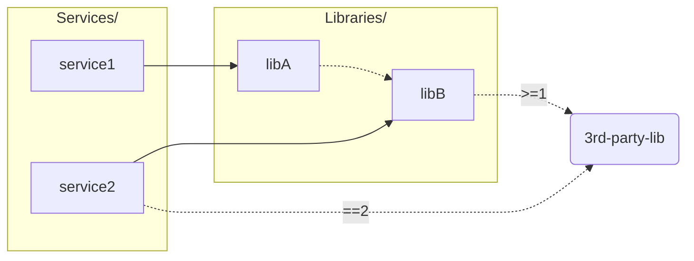

## Repo layout
```
Libraries/
├── libA/
│   └── pyproject.toml (depends on libB)
└── libB/
    └── pyproject.toml (depends on "3rd-party-lib>=1.0")

Services/
├── service1/
│   └── pyproject.toml (depends on libA)
└── service2/
    └── pyproject.toml (depends on libB and "3rd-party-lib==2.0")
```

Visualized:


## Poetry
setup deps:
```shell
poetry lock --directory Libraries/libA
poetry lock --directory Libraries/libB
poetry lock --directory Services/service1
poetry lock --directory Services/service2
```

Use the same library with different major versions of an external dependency:
```
➜  poetry run --directory Services/service1 python Services/service1/service1/main.py
flask version: 3.0.3

➜  poetry run --directory Services/service2 python Services/service2/service2/main.py
flask version: 2.0.0
```

## Pants (no resolves)
The contraints present in pyproject.toml don't apply via pants:
```
➜  pants run Services/service1/service1/main.py                      
flask version: 3.0.3

➜  pants run Services/service2/service2/main.py
flask version: 3.0.3
```
Thats because pants doesn't allow ambigous dependencies, its always mapped back to the same constraint. This is counter-intuitive for libraries.
```
➜  pants dependencies --transitive Services/service1/service1/main.py
Libraries/libB/libb/main.py
Libraries/libB/pyproject.toml:poetry
Libraries/libB:poetry#Flask
Libraries/libB:poetry#setuptools
```

## Pants (single resolve)
If I enable resolves, but leave all other configurations the same (all targets use `python-default` resolve), I get the [following lockfile](https://github.com/jasondamour/pants-vs-poetry/blob/main/3rdparty/python/default.lock). Pants gives the following, which is reasonable but not desired:
```
➜  pants run Libraries/libB/libb/main.py
flask version: 2.3.3
➜  pants run Libraries/libA/liba/main.py
flask version: 2.3.3
➜  pants run Services/service1/service1/main.py                 
flask version: 2.3.3
➜  pants run Services/service2/service2/main.py                 
flask version: 2.3.3
```

## Pants (resolve per module)
If I enable a resolve per-module, then services finally work:
```
➜  pants run Services/service1/service1/main.py
flask version: 3.0.3
➜  pants run Services/service2/service2/main.py
flask version: 2.3.3
```

However, now libraries can't infer simple imports:
```
09:48:51.67 [WARN] Pants cannot infer owners for the following imports in the target Libraries/libA/liba/version.py@resolve=libA:

  * flask (line: 2)
  * pkg_resources (line: 1)

These imports are not in the resolve used by the target (`libA`), but they were present in other resolves:

  * flask: 'libB' from Libraries/libB:poetry#Flask@resolve=libB, 'service1' from Libraries/libB:poetry#Flask@resolve=service1, 'service2' from Libraries/libB:poetry#Flask@resolve=service2, 'service2' from Services/service2:poetry#flask
  * pkg_resources: 'libB' from Libraries/libB:poetry#setuptools@resolve=libB, 'service1' from Libraries/libB:poetry#setuptools@resolve=service1, 'service2' from Libraries/libB:poetry#setuptools@resolve=service2
```

And tests for libA now need to run 4 times! I do not want to test libA against all resolves, I only want to test libA against its own deps. I understand the draw of this feature, but its a moot point because these libraries will be published and consumed by services across the internet and we're not testing against those resolves.
```
➜  pants test ::           
✓ Libraries/libA/liba/main_test.py:tests@resolve=libA succeeded in 0.69s.
✓ Libraries/libA/liba/main_test.py:tests@resolve=libB succeeded in 0.68s.
✓ Libraries/libA/liba/main_test.py:tests@resolve=service1 succeeded in 0.67s.
✓ Libraries/libA/liba/main_test.py:tests@resolve=service2 succeeded in 0.24s.
✓ Libraries/libB/libb/main_test.py:tests@resolve=libB succeeded in 0.70s.
✓ Libraries/libB/libb/main_test.py:tests@resolve=service1 succeeded in 0.67s.
✓ Libraries/libB/libb/main_test.py:tests@resolve=service2 succeeded in 0.70s.
✓ Services/service1/service1/main_test.py:tests succeeded in 0.70s.
✓ Services/service2/service2/main_test.py:tests succeeded in 0.71s.
```
